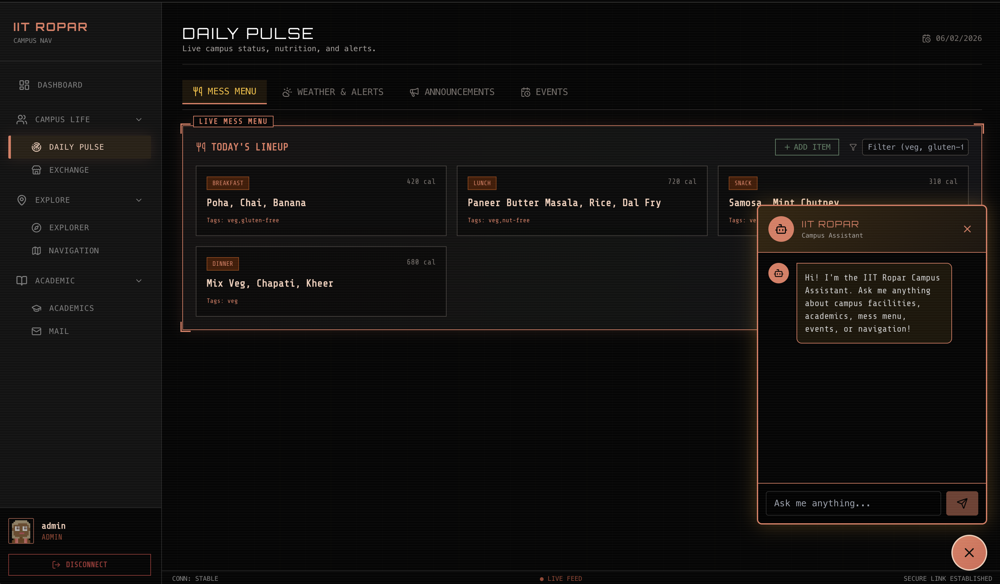

# IIT Ropar Navigation System

**Hosted at:** [https://ai-fusion-26-8hjf.onrender.com](https://ai-fusion-26-8hjf.onrender.com)

A comprehensive campus super-app for IIT Ropar students, featuring AI-powered navigation, mess menu management, mail summarization, and more.



## Features

### Daily Pulse
- Live mess menu with filtering by tags (veg, non-veg, etc.)
- Weather updates and campus alerts
- Announcements and event calendar
- Admin panel for managing menu and announcements

### Explorer's Guide
- Interactive campus map with 15+ locations
- AI-powered navigation between campus buildings
- Nearby places around Rupnagar (restaurants, attractions, transport)
- Category filtering (Campus, Food, Transport, Nature, Spiritual)
- Google Maps integration for external locations

### Mail Summarizer
- AI-powered email summarization using Gemini
- Extracts action items and priority levels
- Categorizes emails automatically

### Student Exchange
- Lost and Found board
- Marketplace for buying/selling items
- Travel/cab sharing to Chandigarh, Delhi, etc.

### Academic Cockpit
- Class timetable organized by day
- Grade tracking
- LMS integration (coming soon)

### AI Chatbot
- Campus-aware assistant for IIT Ropar
- Answers queries about facilities, departments, timings
- Navigation help and general campus information

## Tech Stack

**Frontend:**
- React 19 with TypeScript
- Tailwind CSS
- Framer Motion for animations
- Lucide React icons

**Backend:**
- Node.js with Express
- SQLite database
- JWT authentication
- Google Gemini AI integration

## Installation

**Prerequisites:** Node.js 18+

1. Clone the repository:
   ```bash
   git clone https://github.com/ShivangNagta/AI_Fusion_26.git
   cd AI_Fusion_26
   ```

2. Install frontend dependencies:
   ```bash
   npm install
   ```

3. Install backend dependencies:
   ```bash
   cd server && npm install
   ```

4. Create environment file:
   ```bash
   cp .env.local.example .env.local
   ```
   Add your Gemini API key to `.env.local`:
   ```
   GEMINI_API_KEY=your_api_key_here
   ```

5. Run the backend API:
   ```bash
   cd server && npm run dev
   ```

6. Run the frontend (in a new terminal):
   ```bash
   npm run dev
   ```

7. Open http://localhost:5173 in your browser

## Demo Credentials

- Admin: admin@campus.edu / pass123
- Student: student@campus.edu / pass123

## Project Structure

```
AI_Fusion_26/
├── components/          # Reusable UI components
├── pages/              # Page components
├── services/           # API client
├── server/             # Express backend
│   ├── index.js        # Main server file
│   └── nexus.sqlite    # SQLite database
├── images/             # Project images
├── App.tsx             # Main app component
└── index.tsx           # Entry point
```

## License

MIT License
